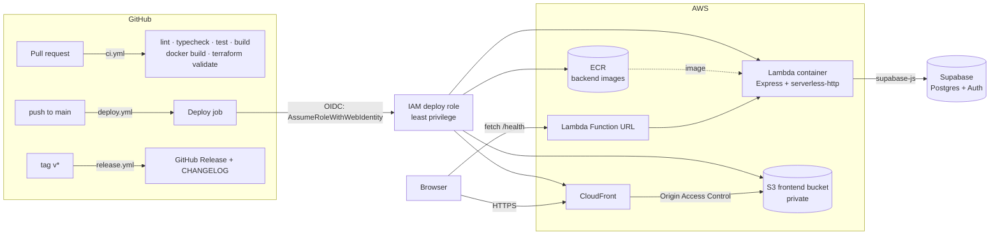

# progress-tracker

> A personal, minimalist life tracker — ongoing tasks and projects, a built-in calendar with
> Google/Apple Calendar sync, and encouraging reminders.
>
> **Status: `0.1.0-alpha` — infrastructure only.** The pipeline is real; the product isn't built yet.

## Overview

This repository currently contains the _plumbing_ for the app, not the app itself:

- A React + Vite + TypeScript frontend with one page — an **Alpha infra status** panel that calls the
  backend's `/health` endpoint and shows pass/fail, the API version, commit, and server time.
- An Express + TypeScript backend that runs as a normal server locally and as a container image on
  AWS Lambda in production, from the same `app` object.
- Terraform for all AWS infrastructure, with remote state.
- GitHub Actions for CI, continuous deployment on every merge to `main`, and tagged releases with a
  generated changelog.

The goal of this milestone: **a trivial change merged to `main` is live at a real URL within minutes,
with a version number and a changelog entry.**

## Architecture



| Piece           | Where                 | Notes                                                                                  |
| --------------- | --------------------- | -------------------------------------------------------------------------------------- |
| Frontend        | `frontend/`           | Static build → private S3 bucket, served only through CloudFront (OAC).                |
| Backend         | `backend/`            | `src/app.ts` is shared; `src/server.ts` runs it locally, `src/lambda.ts` on Lambda.    |
| API endpoint    | Lambda Function URL   | Public (`auth NONE`) for the alpha only; CORS restricted to the CloudFront origin.     |
| Remote state    | `infra/bootstrap/`    | S3 state bucket + DynamoDB lock table. Applied once, with local state.                 |
| Infrastructure  | `infra/main/`         | ECR, Lambda, Function URL, S3 + CloudFront, GitHub OIDC provider + deploy role.        |
| CI/CD auth      | GitHub OIDC → IAM     | No long-lived AWS keys exist anywhere. The role trusts only `main` of this repository. |

## Local development

**Prerequisites:** Node.js 22 (`nvm use` reads `.nvmrc`), npm 10+. Docker is optional (only needed
to test the Lambda image locally).

```bash
npm run setup                               # installs root, frontend/, and backend/ dependencies
cp backend/.env.example backend/.env        # optional — fill in Supabase values to test /health/db
npm run dev                                 # backend on :3001 + frontend on :5173, one terminal
```

Open <http://localhost:5173>. The status panel should show **Pass**. Vite proxies `/health` to the
local backend, so there's no CORS setup locally. The backend runs through `src/server.ts` with
reload on save; the Lambda handler isn't involved.

Without Supabase credentials, `GET /health/db` reports `unconfigured`. That's expected and doesn't
affect `/health`.

### Testing the Lambda image locally (optional)

The production artifact is a container built from `backend/Dockerfile` on the AWS Lambda Node.js 22
base image. That base image includes the Lambda Runtime Interface Emulator, so you can invoke the real
handler (`dist/lambda.handler`) without AWS:

```bash
cd backend
npm run docker:build          # buildx, linux/amd64, --provenance=false (same flags CI uses)
npm run docker:run            # emulator on :9000 — leave running, use a second terminal:
curl -s -X POST localhost:9000/2015-03-31/functions/function/invocations \
  -d @events/function-url-health.json
```

The response body should contain `"version":"0.1.0-alpha"`. To test `/health/db` against Supabase
here, add `--env-file .env` to the `docker run` command.

> **Linux/WSL:** if Docker says `permission denied ... docker.sock`, add yourself to the `docker`
> group (`sudo usermod -aG docker $USER`) and start a new shell.

### Everyday commands (run from the repo root; each fans out to both packages)

| Command                | What it does                                   |
| ---------------------- | ---------------------------------------------- |
| `npm run dev`          | Run backend + frontend together                |
| `npm run lint`         | ESLint, zero warnings allowed                  |
| `npm run typecheck`    | `tsc` in both packages                         |
| `npm test`             | Vitest, single run                             |
| `npm run build`        | Production builds                              |
| `npm run format:check` | Prettier check (use `npm run format` to fix)   |

## Deployment

<!-- DEPLOYMENT_DETAILS -->

## Release Process

<!-- RELEASE_DETAILS -->

## Alpha status & known limitations

<!-- LIMITATIONS -->
