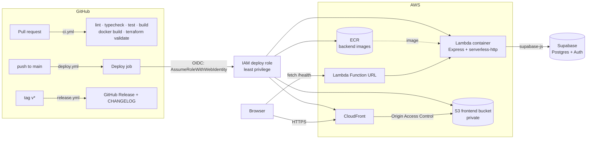

# progress-tracker

> A personal, minimalist life tracker — ongoing tasks and projects, a built-in calendar with
> Google/Apple Calendar sync, and encouraging reminders.
>
> **Status: `0.1.0-alpha` — infrastructure only.** The pipeline is real; the product isn't built yet.

## Overview

This repository currently contains the _plumbing_ for the app, not the app itself:

- A React + Vite + TypeScript frontend with one page — an **Alpha infra status** panel that calls the
  backend's `/health` endpoint and shows pass/fail, the API version, commit, and server time.
- An Express + TypeScript backend that runs as a normal server locally and as a container image on
  AWS Lambda in production, from the same `app` object.
- Terraform for all AWS infrastructure, with remote state.
- GitHub Actions for CI, continuous deployment on every merge to `main`, and tagged releases with a
  generated changelog.

The goal of this milestone: **a trivial change merged to `main` is live at a real URL within minutes,
with a version number and a changelog entry.**

## Architecture



| Piece          | Where               | Notes                                                                                  |
| -------------- | ------------------- | -------------------------------------------------------------------------------------- |
| Frontend       | `frontend/`         | Static build → private S3 bucket, served only through CloudFront (OAC).                |
| Backend        | `backend/`          | `src/app.ts` is shared; `src/server.ts` runs it locally, `src/lambda.ts` on Lambda.    |
| API endpoint   | Lambda Function URL | Public (`auth NONE`) for the alpha only; CORS restricted to the CloudFront origin.     |
| Remote state   | `infra/bootstrap/`  | S3 state bucket + DynamoDB lock table. Applied once, with local state.                 |
| Infrastructure | `infra/main/`       | ECR, Lambda, Function URL, S3 + CloudFront, GitHub OIDC provider + deploy role.        |
| CI/CD auth     | GitHub OIDC → IAM   | No long-lived AWS keys exist anywhere. The role trusts only `main` of this repository. |

## Local development

**Prerequisites:** Node.js 22 (`nvm use` reads `.nvmrc`), npm 10+. Docker is optional (only needed
to test the Lambda image locally).

```bash
npm run setup                               # installs root, frontend/, and backend/ dependencies
cp backend/.env.example backend/.env        # optional — fill in Supabase values to test /health/db
npm run dev                                 # backend on :3001 + frontend on :5173, one terminal
```

Open <http://localhost:5173>. The status panel should show **Pass**. Vite proxies `/health` to the
local backend, so there's no CORS setup locally. The backend runs through `src/server.ts` with
reload on save; the Lambda handler isn't involved.

Without Supabase credentials, `GET /health/db` reports `unconfigured`. That's expected and doesn't
affect `/health`.

### Testing the Lambda image locally (optional)

The production artifact is a container built from `backend/Dockerfile` on the AWS Lambda Node.js 22
base image. That base image includes the Lambda Runtime Interface Emulator, so you can invoke the real
handler (`dist/lambda.handler`) without AWS:

```bash
cd backend
npm run docker:build          # buildx, linux/amd64, --provenance=false (same flags CI uses)
npm run docker:run            # emulator on :9000 — leave running, use a second terminal:
curl -s -X POST localhost:9000/2015-03-31/functions/function/invocations \
  -d @events/function-url-health.json
```

The response body should contain `"version":"0.1.0-alpha"`. To test `/health/db` against Supabase
here, add `--env-file .env` to the `docker run` command.

> **Linux/WSL:** if Docker says `permission denied ... docker.sock`, add yourself to the `docker`
> group (`sudo usermod -aG docker $USER`) and start a new shell.

### Everyday commands (run from the repo root; each fans out to both packages)

| Command                | What it does                                 |
| ---------------------- | -------------------------------------------- |
| `npm run dev`          | Run backend + frontend together              |
| `npm run lint`         | ESLint, zero warnings allowed                |
| `npm run typecheck`    | `tsc` in both packages                       |
| `npm test`             | Vitest, single run                           |
| `npm run build`        | Production builds                            |
| `npm run format:check` | Prettier check (use `npm run format` to fix) |

## Deployment

### How it works

Every pull request into `main` runs CI (`.github/workflows/ci.yml`): both packages are
format-checked, linted, typechecked, tested and built; the backend's Lambda image is built (not
pushed); and both Terraform roots are `fmt`-checked and validated.

Every push to `main` runs `.github/workflows/deploy.yml`, which re-runs all of CI and then:

1. Authenticates to AWS with **GitHub OIDC** — a short-lived token exchanged for the IAM role in
   `infra/main/github_oidc.tf`. There are no stored AWS keys, and the role trusts only pushes to
   `main` of this repository.
2. Builds and pushes the backend image to ECR, tagged with the commit SHA.
3. Points the Lambda at the new image, sets its `SUPABASE_*` environment from GitHub secrets, then
   smoke-tests `GET /health` and **fails the deploy unless the live `commit` matches the pushed
   commit**.
4. Builds the frontend against the Function URL and uploads it to S3 — hashed assets first,
   `index.html` last, stale objects deleted only at the end — then invalidates CloudFront.

Typical run: a few minutes. Deploys never run concurrently and are never cancelled midway.

### First-time infrastructure setup

Terraform has **not been applied** — the whole stack is still just code. Run these yourself, in
order, from the repo root, with AWS CLI v2 signed in (SSO recommended) and Docker available.
`infra/main/lambda.tf` explains why it takes two passes: a container-image Lambda cannot be
created before an image exists in the repository that the same root creates.

```bash
# 0. Remote state — once per AWS account
terraform -chdir=infra/bootstrap init
terraform -chdir=infra/bootstrap apply
terraform -chdir=infra/bootstrap output -raw backend_hcl > infra/main/backend.hcl

# 1. Main stack, pass 1: the ECR repository only
terraform -chdir=infra/main init -backend-config=backend.hcl
terraform -chdir=infra/main apply -target=aws_ecr_repository.backend

# 2. Push the bootstrap image
REGION=us-east-1
REPO="$(terraform -chdir=infra/main output -raw ecr_repository_url)"
aws ecr get-login-password --region "$REGION" | docker login --username AWS --password-stdin "${REPO%%/*}"
docker buildx build --platform linux/amd64 --provenance=false \
  --build-arg GIT_SHA=bootstrap -t "$REPO:bootstrap" --push backend

# 3. Main stack, pass 2: everything else (CloudFront takes several minutes)
terraform -chdir=infra/main apply

# 4. Verify the backend, then publish the GitHub secrets
curl -s "$(terraform -chdir=infra/main output -raw lambda_function_url)health"
terraform -chdir=infra/main output -json github_secrets \
  | jq -r 'to_entries[] | "\(.key)\t\(.value)"' \
  | while IFS=$'\t' read -r name value; do gh secret set "$name" --body "$value"; done
```

Keep `infra/bootstrap/terraform.tfstate` safe — it is gitignored and stays on your machine.
Losing it deletes nothing; the resources can be re-imported.

### Required GitHub secrets

All nine must exist before the first push to `main`, or the deploy fails at role assumption. The
AWS account ID is deliberately **not** stored — it's derived at runtime.

| Secret                                                                                                                         | Where it comes from                                                      |
| ------------------------------------------------------------------------------------------------------------------------------ | ------------------------------------------------------------------------ |
| `AWS_REGION`, `AWS_ROLE_ARN`, `ECR_REPOSITORY_URI`, `LAMBDA_FUNCTION_NAME`, `S3_FRONTEND_BUCKET`, `CLOUDFRONT_DISTRIBUTION_ID` | `terraform -chdir=infra/main output -json github_secrets` (step 4 above) |
| `SUPABASE_URL`, `SUPABASE_ANON_KEY`, `SUPABASE_SERVICE_ROLE_KEY`                                                               | Supabase dashboard → Project Settings → API                              |

The service-role key bypasses Row Level Security. It is only ever set on the Lambda and must never
reach the browser.

### Recommended branch protection (set these by hand in GitHub's UI)

**Settings → General → Pull Requests:** allow **squash merging only**, set the default commit
message to **"Pull request title"** (git-cliff reads those titles), and auto-delete head branches.

**Settings → Rules → Rulesets** targeting `main`: require a pull request (0 approvals is fine when
you're solo — GitHub won't let you approve your own); require status checks `frontend`, `backend`,
`repo`, `terraform`, `pr-title` (they only appear in the picker after running once, so open a
throwaway PR first); require branches to be up to date; block force pushes; restrict deletions.
Do **not** require signed commits — the release workflow's changelog commit would be rejected.
Add a second ruleset targeting tag `v*` restricting who can create or delete tags.

**Settings → Actions → General:** require approval for all outside collaborators' workflow runs,
and enable "Allow GitHub Actions to create and approve pull requests" so the changelog fallback
pull request can be opened.

## Release Process

Versions follow SemVer, starting at `0.1.0-alpha`, and the version in `package.json` is what
`GET /health` reports — so a release is a real, checkable claim about what is live.

```bash
git switch -c release/v0.1.1-alpha
npm run release:prepare -- 0.1.1-alpha     # bumps all 3 packages + lockfiles, writes CHANGELOG.md
# review and edit the generated changelog section, then:
git commit -am "chore(release): v0.1.1-alpha"
gh pr create --title "chore(release): v0.1.1-alpha"
# merge the PR — merging deploys it — then tag the merged commit:
git switch main && git pull
git tag v0.1.1-alpha && git push origin v0.1.1-alpha
```

Pushing the tag runs `.github/workflows/release.yml`, which verifies the tag is valid SemVer,
matches all three `package.json` versions, and points at a commit on `main` (i.e. one that was
actually deployed), then publishes a GitHub Release using the `CHANGELOG.md` section — marked as a
pre-release automatically while the version has an `-alpha` suffix.

**A tag does not deploy anything.** The commit went live when its pull request merged; the tag and
Release are the record of what that version contains. If you tag without running
`release:prepare`, the workflow still publishes notes generated from commit messages and opens a
pull request to backfill the changelog.

Changelog entries come from Conventional Commit messages. Because `main` uses squash merges, the
**pull request title** is the commit message — `pr-title` enforces the format on every PR.

## Alpha status & known limitations

This milestone deliberately proves the pipeline, not the product.

**Not built yet (intentionally stubbed):** no authentication or login, no calendar or
Google/Apple Calendar sync, no reminders or notifications, no task/project tracking, and no
database schema. Supabase is wired up and reachable, but nothing reads or writes data.

**Alpha infrastructure caveats, roughly in priority order:**

| Limitation                                         | Detail                                                                                                                          | When to fix                                                                                                  |
| -------------------------------------------------- | ------------------------------------------------------------------------------------------------------------------------------- | ------------------------------------------------------------------------------------------------------------ |
| **The API is public and unauthenticated**          | The Lambda Function URL uses `authorization_type = "NONE"`. CORS restricts browsers, not scripts.                               | **Before any real user data exists.** Move to IAM auth behind CloudFront, or API Gateway with an authorizer. |
| **No spend guard**                                 | A flood of requests to the public URL could run up Lambda and CloudWatch charges. Expected cost otherwise is ~$0.05–0.25/month. | Set an AWS Budgets alert now; add reserved concurrency once the account's concurrency quota allows it.       |
| **`/health/db` calls Supabase on every request**   | It is public and unthrottled, so it can burn Supabase quota.                                                                    | Cache the probe result, or require auth, before launch.                                                      |
| **Supabase keys live in the Lambda's environment** | Readable by anyone with AWS console access to the function.                                                                     | Move to SSM Parameter Store or Secrets Manager when the account has more than one user.                      |
| **No custom domain**                               | The app is served from a `*.cloudfront.net` URL and the API from a `*.lambda-url.*.on.aws` URL.                                 | Whenever you want a real address; needs an ACM certificate in us-east-1.                                     |
| **No staging environment**                         | `main` deploys straight to the only environment.                                                                                | When breaking production starts to matter.                                                                   |
| **Single region, no backups**                      | Everything is in one region; there is no state-bucket replication.                                                              | Post-alpha.                                                                                                  |
| **CloudFront SPA fallback masks 404s**             | A missing asset returns `index.html` with a 200.                                                                                | Acceptable for a SPA; revisit if it hides real errors.                                                       |

**Verified in this pass:** both apps run together locally, the backend's health endpoints behave
correctly (including six Supabase failure modes), 31 tests pass, the Terraform validates, and all
four workflows pass actionlint. **Not verified:** anything requiring real AWS or Docker — no
Terraform has been applied, no image has ever been built or pushed, and the pipeline has never
run.
