# Supabase schema — goals, progress, calendar

Design notes for the `progress-tracker` data layer.

**The `20260916*` migrations are applied to the hosted Supabase project. They are immutable —
never edit one in place again.** The `20260917*` files are `0.2.0-alpha` Phase 1 (anonymous
accounts, real RLS, expiry, limits) and the `20260918*` files are Phase 2 (the goal catalogue and
the writes). Neither set has been applied; applying them is a human decision (see
[Applying](#applying-the-migrations)).

| Path                                                   | What it is                                                           |
| ------------------------------------------------------ | -------------------------------------------------------------------- |
| `migrations/20260916090000_init_types_and_helpers.sql` | enums + table-independent functions                                  |
| `migrations/20260916090100_core_tables.sql`            | the six tables and their constraints                                 |
| `migrations/20260916090200_indexes_and_triggers.sql`   | indexes, triggers, `expand_recurrence()`                             |
| `migrations/20260916090300_progress_views.sql`         | `goal_progress`, `goal_dashboard`                                    |
| `migrations/20260916090400_row_level_security.sql`     | RLS, policies, grants, identity helpers                              |
| `migrations/20260916090500_reference_data.sql`         | the six built-in life areas + the login-less user                    |
| `migrations/20260917100000_anonymous_identity.sql`     | `last_seen_at`, `is_anonymous`, the `auth.users` FK + signup trigger |
| `migrations/20260917100100_ownership_hardening.sql`    | composite FKs that close two cross-tenant holes                      |
| `migrations/20260917100200_usage_limits.sql`           | per-account caps and free-text length limits                         |
| `migrations/20260917100300_rate_limits.sql`            | the shared request counter                                           |
| `migrations/20260917100400_session_expiry.sql`         | `delete_expired_anonymous_users()`                                   |
| `migrations/20260917100500_session_rpc.sql`            | `begin_request()` — identity + quota + touch                         |
| `seed.sql`                                             | eight demo goals, local development only                             |

## ERD

```mermaid
erDiagram
    users ||--o{ life_areas : "owns (NULL owner = built-in)"
    users ||--o{ goals : has
    life_areas ||--o{ goals : "colours + groups"
    life_areas ||--o{ goal_templates : "files under"

    goals ||--o{ recurrences : "repeats by"
    goals ||--o{ calendar_entries : "tracked by"
    goals ||--o{ progress_entries : "measured by"
    recurrences ||--o{ calendar_entries : materialises
    calendar_entries |o--o| progress_entries : "check-in logged from"

    users {
        uuid id PK
        uuid auth_user_id UK "FK to auth.users, ON DELETE CASCADE"
        text display_name
        text time_zone "IANA; defines this user's today"
        smallint week_starts_on "ISO 1=Mon..7=Sun"
        boolean is_anonymous "throwaway session; only these expire"
        timestamptz last_seen_at "sliding 90-day expiry clock"
    }
    life_areas {
        uuid id PK
        uuid user_id FK "NULL = built-in, shared by all"
        text slug
        text name
        text color "light-theme hex; a goal inherits it"
        integer sort_order
        boolean is_system "generated: user_id IS NULL"
    }
    goals {
        uuid id PK
        uuid user_id FK
        uuid life_area_id FK "nullable"
        text title
        text description "notes"
        goal_kind kind "scheduled | measured | habit"
        goal_status status "active | paused | completed | archived"
        goal_size size "small | medium | large -- tile size"
        text color_override "wins over the area colour"
        date start_date
        date target_date "optional deadline"
        integer sort_order "deterministic layout only"
        text measurement_unit "measured only"
        numeric start_value "measured only"
        numeric target_value "measured only"
        integer target_count "habit only: aiming for 3"
        integer minimum_count "habit only: 1 still counts"
        habit_period habit_period "habit only: day|week|month"
        integer target_sessions "scheduled only; NULL = open-ended"
        timestamptz completed_at
        timestamptz archived_at
    }
    recurrences {
        uuid id PK
        uuid goal_id FK
        uuid user_id FK
        recurrence_freq freq "daily | weekly | monthly"
        smallint interval_count "every N"
        smallint_array byweekday "weekly: ISO days"
        date start_date
        date until_date "NULL = forever"
        time start_time "LOCAL wall clock"
        time end_time
        text time_zone "IANA"
        date generated_through "materialisation horizon"
        boolean is_active
    }
    calendar_entries {
        uuid id PK
        uuid user_id FK
        uuid goal_id FK "NULL = plain calendar item"
        uuid recurrence_id FK "NULL = one-off"
        text title "NULL = use the goal's"
        date entry_date "always; derived for timed entries"
        timestamptz start_at "NULL = untimed"
        timestamptz end_at "NULL = untimed"
        text time_zone
        entry_status status "planned|completed|skipped|cancelled"
        timestamptz completed_at
        boolean is_exception "edited away from its rule"
        boolean created_by_completion "row exists only to record a completion"
        entry_status pre_completion_status "what undo restores"
    }
    goal_templates {
        uuid id PK
        uuid life_area_id FK "which area files it"
        text slug UK
        text title "second person, deliberately unspecific"
        goal_kind kind
        numeric suggested_start_value "NULL = the person supplies it"
        numeric suggested_target_value
        integer suggested_target_count "habit"
        integer suggested_minimum_count "habit; well below target"
        habit_period suggested_habit_period
        integer suggested_target_sessions "scheduled"
        recurrence_freq suggested_freq "cadence for the rule editor"
        boolean is_active "retire, never delete"
    }
    progress_entries {
        uuid id PK
        uuid user_id FK
        uuid goal_id FK
        uuid calendar_entry_id FK "nullable link to the timeline"
        date occurred_on
        numeric value
        text note
    }
```



## The modelling decisions that matter

### One `goals` table, three kinds

A base table plus one table per kind would type the three shapes more strongly, but it turns
the dashboard into a three-way join or union for no gain at this size. Instead the
kind-specific columns live on `goals` and a single CHECK (`goals_kind_fields`) makes a
wrong-shaped goal unstorable: a measured goal must have both `start_value` and
`target_value` and must not carry `target_count`, and so on.

That CHECK ends in `else false`. Adding a value to `goal_kind` therefore _breaks inserts of
that kind_ until its required fields are declared — a deliberate tripwire, not an oversight.

**Direction is derived, not stored.** `start_value > target_value` means the number must fall
(82 kg → 77 kg); `start_value < target_value` means it must rise (0 → 2000 saved). One
formula covers both, and `target_value <> start_value` is enforced so the denominator is
never zero.

### The six life areas

The list is **final for 0.1.x** — exactly six, no more, no fewer. Health & Wellbeing absorbs
exercise; there is no separate movement area.

| Name                 | Slug            | Light-theme hex | Icon key    |
| -------------------- | --------------- | --------------- | ----------- |
| Health & Wellbeing   | `health`        | `#2e7d57`       | `heart`     |
| Learning & Skills    | `learning`      | `#4f52c7`       | `book`      |
| Money & Finances     | `money`         | `#8a6410`       | `wallet`    |
| Relationships        | `relationships` | `#a6416b`       | `users`     |
| Work & Career        | `work`          | `#14717f`       | `briefcase` |
| Creativity & Hobbies | `creative`      | `#7d4aa8`       | `palette`   |

**`life_areas.color` stores the light-theme hex and nothing else.** The frontend derives the
dark-theme colour from the `slug`, so the stored value stays single-valued: there is no
second column to keep in step, no way for the two themes to disagree in the database, and
changing the dark palette is a frontend change that needs no migration. The design agent owns
both palettes and the meaning of the icon keys; what is here is data, not styling. A goal's
colour resolves as `color_override → area.color → '#64748B'`.

They are **rows, not an enum**, even though the list is fixed today — because user-defined
areas are a planned release and adding one must not require a migration. The mechanism is
already in place and unchanged: `user_id IS NULL` is a built-in area shared by everyone
(`is_system` is a generated column), a row with an owner is that user's own, and the two are
uniqued by separate partial indexes.

### Kind, status and size are enums

`goal_kind`, `goal_status`, `goal_size`, `habit_period`, `entry_status` and `recurrence_freq`
are genuinely closed sets, and they are **native enums** rather than text + CHECK for one
concrete reason:
`supabase gen types typescript` turns an enum into a real TypeScript union
(`'scheduled' | 'measured' | 'habit'`) while a CHECK constraint yields bare `string`. In a
strict-TypeScript codebase that is worth the cost, which is:

```sql
alter type public.goal_kind add value if not exists 'milestone';
```

cannot be used in the same transaction that adds it, and enum values can be renamed but never
removed. If either of those ever bites, the escape hatch is a lookup table plus an FK.

### Goal size: an enum, for the same reason as `goal_kind`

`goals.size` is `small | medium | large`, defaulting to `medium`. The dashboard is an
unsorted canvas of tiles and size is how the person says _this one matters more_ — chosen at
creation, changed whenever they like, and **never derived by the app** from progress, deadline
or kind.

**Enum, not `text` + CHECK.** Same reasoning as `goal_kind`, and it applies more strongly
here, because the two costs of an enum are both close to zero for this column:

- _Adding a value is awkward_ (`ALTER TYPE ... ADD VALUE` cannot run in the transaction that
  added it). But `size` is a three-step scale, not a list that grows. If a fourth step is ever
  wanted it is one deliberate migration, not a routine operation.
- _Values can be renamed but never dropped._ Nothing about `small`/`medium`/`large` is likely
  to be renamed.

Against that, `supabase gen types typescript` turns the enum into
`'small' | 'medium' | 'large'`, which is exactly what a strict-TypeScript tile component wants
to switch on; a CHECK constraint would hand it bare `string` and the exhaustiveness check
would be lost. A CHECK would have been the better call if this were an open-ended
vocabulary — it is not.

`sort_order` stays, and its job is now narrower: the canvas is unsorted, but a layout has to
be _deterministic_ across reloads, so `order by sort_order, created_at` remains the API's
ordering.

### Habits have a minimum as well as a target

> "User can choose target of habit, but the app will keep encouraging and motivating as long
> as a minimum is met. Example: workout 4 times a week. As long as user works out 1 time a
> week, the app will display motivation and encouragement to continue."

`goals.minimum_count` is that floor: an integer, `>= 1`, `<= target_count`, and folded into
the same `goals_kind_fields` CHECK as everything else kind-specific, so it can exist **only**
on a habit and **must** exist on one.

**It defaults to 1 through the `goals_before_write` trigger, not a column `DEFAULT`.** A
column default applies to every kind, so a measured goal inserted without mentioning
`minimum_count` would silently get `1` and then fail the CHECK that requires NULL off habits.
Defaulting only when `kind = 'habit'` keeps `insert ... kind='habit', target_count=4` valid
while a `minimum_count` on a non-habit still raises — the tripwire is worth keeping.

**The view answers the question; the dashboard never computes it.** `public.goal_progress`
(and so `public.goal_dashboard`) exposes, alongside `progress_fraction`:

| Column                    | Meaning                                                                        |
| ------------------------- | ------------------------------------------------------------------------------ |
| `period_minimum_count`    | the floor itself (`minimum_count` on the dashboard view)                       |
| `period_minimum_met`      | `true`/`false` for habits, **`NULL` for other kinds** — the idea doesn't apply |
| `period_minimum_fraction` | 0..1 progress _towards the minimum_; hits 1 exactly when `..._met` flips true  |

`period_minimum_met = false` is **not a failure state**, and nothing in the schema names one.
It means the nudge should be "one is enough this week", not "you missed". Above the minimum,
per the owner, it never is a failure at all.

The whole UI query is one row:

```sql
select title, size, color,
       progress_fraction,          -- the ring: completions / target_count
       period_minimum_fraction,    -- the floor: completions / minimum_count
       period_minimum_met,         -- true => encourage; false => "one still counts"
       period_completed_count, target_count, minimum_count,
       period_start, period_end
from public.goal_dashboard
where user_id = $1 and status = 'active'
order by sort_order, created_at;
```

A habit at 1 of 3 with a minimum of 1 comes back as
`progress_fraction 0.3333, period_minimum_fraction 1.0000, period_minimum_met true`.

### Unplanned completions count

> "can define target days when wants to run, but can also add the days that they run even if
> not defined as target. and it would count towards the weekly goal"

This is a product rule, and it falls out of the model rather than needing special support —
but it was **verified, not assumed**:

- A habit may have a recurrence. Recurrences are not only for scheduled goals; nothing
  constrains them by kind. The rule's occurrences are the _target days_ — a plan, not a gate.
- A completion with `recurrence_id IS NULL` is an ad-hoc entry. The unique index that makes
  expansion idempotent is `(recurrence_id, entry_date) WHERE recurrence_id IS NOT NULL`, so
  ad-hoc entries are outside it entirely: **two runs on one day are both storable**, and an
  ad-hoc run on a planned day does not collide with the planned occurrence.
- `public.goal_progress` counts `status = 'completed'` entries inside the current period and
  is **deliberately not filtered on `recurrence_id`**. Origin is irrelevant to whether it
  happened.
- `public.expand_recurrence()` only ever INSERTs, and only ever with `recurrence_id = r.id`,
  so re-expansion cannot overwrite, delete or dedupe an ad-hoc completion away.
- The "rule changed, regenerate the series" snippet below deletes only rows
  `where recurrence_id = $1`, so ad-hoc entries survive that too.

_Verified on PostgreSQL 17:_ with the demo's running habit at 1 of 3 (minimum met), inserting
one completion with `recurrence_id IS NULL` on a day the rule never named moved
`period_completed_count` 1 → 2 and `progress_fraction` 0.3333 → 0.6667; re-expanding the rule
afterwards left both unchanged and the ad-hoc row in place.

### Dates vs instants

- **`timestamptz`** for instants: `created_at`, `completed_at`, `start_at`/`end_at`.
- **`date`** for day-granularity facts: `entry_date`, `occurred_on`, `target_date`. A weigh-in
  happens on a day, not at an instant, and storing it as a timestamp invents precision that
  then has to be un-invented in every query.
- **`time` + `text` IANA zone** on `recurrences` — never a timestamptz. "19:00 in
  Europe/Madrid every Tuesday" must stay 19:00 across a DST change; storing the first instant
  and adding 7 days drifts by an hour in late October. The zone is stored because the rule
  means nothing without it. _Verified:_ expanding a Madrid rule across 2026-10-25 yields
  `17:00Z, 17:00Z, 18:00Z, 18:00Z` — 19:00 local throughout.

`users.time_zone` **is** needed and is stored: it decides what "today" is (so a habit week
does not roll over at the wrong moment) and supplies the default zone for entries. The
progress view uses `(now() at time zone u.time_zone)::date`, never the server's date.

`calendar_entries.entry_date` is always present, even for timed entries, so "show me this
week" is one index scan for timed and untimed rows alike. It is **derived** from `start_at`
by a BEFORE trigger, so the denormalised day can never drift from the instant. (Insert an
entry claiming `1999-01-01` with a real `start_at` and it is silently corrected.)

### Recurrence: store the rule _and_ materialise the rows

A recurrence backs **any** goal kind, not just scheduled ones. For a scheduled goal its
occurrences are the sessions; for a habit they are the _target days_, which the person is free
to ignore in favour of doing it on some other day (see [Unplanned completions
count](#unplanned-completions-count)).

Three options, honestly weighed:

| Approach                                    | Cost                                                                                                                                                                                                     |
| ------------------------------------------- | -------------------------------------------------------------------------------------------------------------------------------------------------------------------------------------------------------- |
| Rule only, expand on read                   | Cheap storage, infinite recurrence for free. But per-occurrence state (completed/skipped/moved) needs an exception table anyway, and every calendar read becomes a computation instead of an index scan. |
| Materialised rows only                      | Simplest queries, but "every Tuesday forever" has no row count, and editing the series means rewriting history.                                                                                          |
| **Rule + bounded materialisation** ← chosen | Both tables to keep in step, and a horizon job to run.                                                                                                                                                   |

`public.expand_recurrence(rule_id, through_date)` writes occurrences up to a horizon and
records it in `recurrences.generated_through`. The backend extends the horizon (e.g. "keep 90
days materialised") on a schedule or lazily when the calendar is read past it.

The honest tradeoff: **a rule with no end date is only real as far as it has been expanded.**
If the horizon job stops, the calendar quietly goes empty beyond `generated_through`. That is
worth a health check.

What this buys: editing or completing one occurrence is just an `UPDATE` on one row. A unique
index on `(recurrence_id, entry_date)` makes expansion idempotent (`ON CONFLICT DO NOTHING`),
so re-expanding **never** touches an existing row and a completed lesson always survives.
Mark a hand-edited occurrence `is_exception = true`; when a rule changes, the backend deletes
only future `planned` non-exception rows and re-expands:

```sql
delete from public.calendar_entries
where recurrence_id = $1 and status = 'planned' and not is_exception and entry_date > current_date;
update public.recurrences set generated_through = null where id = $1;
select public.expand_recurrence($1, current_date + 90);
```

### Progress is computed, never stored

Every input is already a row — a completed occurrence, a check-in — so a cached percentage
would only add a way for the dashboard to be wrong. `public.goal_progress` is a view with one
row per goal and a comparable `progress_fraction` (0..1) plus `progress_basis` naming the rule
that produced it, so the UI can label it honestly rather than pretending all three kinds mean
the same thing.

| Kind          | `progress_basis`    | Fraction                                                                                                                                                                                       |
| ------------- | ------------------- | ---------------------------------------------------------------------------------------------------------------------------------------------------------------------------------------------- |
| **measured**  | `measured_value`    | `(latest − start) / (target − start)`, clamped to [0,1]. Latest = newest `progress_entries` by `(occurred_on, created_at)`; with no check-in it is `start_value`, i.e. 0.                      |
| **habit**     | `period_completion` | completed entries **in the current period** ÷ `target_count`, whatever their origin. "Run 3× a week" is 2/3 on Wednesday and 0/3 again on Monday. Period bounds honour `users.week_starts_on`. |
| **scheduled** | `session_target`    | completed sessions ÷ `target_sessions`, when the goal is finite.                                                                                                                               |
| **scheduled** | `session_adherence` | open-ended: completed ÷ **due so far** (`entry_date <= user's today`). The only honest 0..1 for a goal with no end.                                                                            |
| **scheduled** | `none`              | open-ended with nothing due yet → `progress_fraction` is `NULL`. The UI should show the session count, not a 0% ring.                                                                          |

Habits additionally carry `period_minimum_met` / `period_minimum_fraction`, so the
encouragement rule is answered in SQL rather than re-derived per client — see [Habits have a
minimum as well as a target](#habits-have-a-minimum-as-well-as-a-target).

Measured goals carry `previous_value` / `previous_measured_on` as well as `current_value`.
That is the second-newest check-in, and it exists so a tile can say _"up 0.7 kg since the
3rd"_ calmly instead of just rendering a smaller ring with no explanation. It is a plain fact,
deliberately not a `has_regressed` flag: the schema reports what happened and the UI chooses
the words. (A single `DISTINCT ON` cannot return the runner-up, so this is a `row_number()`
window over the same `progress_entries_goal_recent_idx` — one indexed pass, not two.)

`cancelled` entries are excluded everywhere (mistakes, not missed sessions); `skipped` ones
still count as _due_, which is what makes adherence meaningful.

"When did I last make progress" is `last_progress_on`: the later of the last completed entry
and the last check-in (`GREATEST` ignores NULLs).

**Where repetition progress lives:** a completed `calendar_entry` _is_ the record of a session
kept or a habit ticked — it is not duplicated into `progress_entries`, which holds numeric
check-ins only. The view unions the two, so there is no write-side trigger keeping two copies
in step and no way for them to disagree.

If these views ever get slow, the fix is a materialised view refreshed on write — not a
denormalised column.

### The dashboard query

`public.goal_dashboard` joins goal + area + progress and is the API's whole read surface:

```sql
select *
from public.goal_dashboard
where user_id = $1 and status = 'active'
order by sort_order, created_at;
```

_Verified_ that the driving scan is `Index Scan using goals_dashboard_idx` with no sort step;
the habit period count is an `Index Only Scan` on `calendar_entries_goal_completed_idx` and
the check-in history one indexed pass over `progress_entries_goal_recent_idx`. The calendar's
range query is likewise a single index scan:

```sql
select * from public.calendar_entries
where user_id = $1 and entry_date between $2 and $3
order by entry_date, start_at nulls first;
```

### Identity: anonymous accounts

Every visitor is signed in. Supabase **anonymous sign-in** mints a real `auth.users` row and an
access token in the browser with no sign-in screen, the browser sends it as
`Authorization: Bearer …`, and PostgREST verifies the signature before anything of ours runs. So
`auth.uid()` is a verified fact and the RLS policies written in `20260916090400` finally do the
isolating. Converting the account later (email or OAuth) keeps every row: GoTrue flips
`is_anonymous` on the _same_ `auth.users` row, and everything is keyed on its id.

The chain that makes that work:

1. `users.auth_user_id` → `auth.users(id)` **`ON DELETE CASCADE`**. Deleting the auth account
   deletes the profile, and the profile's own FKs cascade to goals → rules, entries, check-ins.
2. `on_auth_user_created`, a `SECURITY DEFINER` trigger on `auth.users`, inserts the
   `public.users` row at signup, so a visitor has a profile before their first request.
3. `on_auth_user_updated` keeps `public.users.is_anonymous` in step, so a converted account stops
   expiring.
4. `public.begin_request(kind)` — one round trip per request that proves the token maps to a
   profile, charges the request against this account's quota, refreshes `last_seen_at`, and
   returns the profile. It is the only `SECURITY DEFINER` function on a request path; it takes no
   identity from its caller, only `(select auth.uid())`.

**`is_default` and `public.default_user_id()` are gone.** They answered "which row is _the_
user", and with a session per visitor there is no _the_ user. The backend's `DEFAULT_USER_ID` env
var went with them.

`20260916090500_reference_data.sql` still inserts its fixed-id row
(`00000000-0000-4000-8000-000000000001`) and `seed.sql` still hangs the eight demo goals off it.
That row now has `auth_user_id IS NULL`, which matches **no** policy (`auth_user_id = auth.uid()`
is NULL, never true), so it is invisible to every session rather than visible to all of them, and
`is_anonymous = false` keeps the expiry sweep away from it. Locally it is what gives
`supabase db reset` a populated board. **In the hosted project it is `0.1.1-alpha`'s demo content
sitting where nobody can see it** — harmless, but dead weight. Removing it is a deliberate act:

```sql
delete from public.users where id = '00000000-0000-4000-8000-000000000001';
```

### Expiry: 90 days, sliding, computed not stored

An anonymous account whose owner has not returned for **90 days** is deleted, and its rows go with
it. `public.delete_expired_anonymous_users()` deletes from **`auth.users`** — not `public.users` —
because that is the root of the cascade; deleting only the profile would leave a live token
pointing at nothing. It is `SECURITY DEFINER`, granted to `service_role` alone, idempotent,
batched (`p_limit`) and concurrency-safe (`FOR UPDATE SKIP LOCKED`), and it returns how many
accounts it removed.

**The deadline is computed from `last_seen_at`, not stored as an `expires_at`.** A stored column
is the same fact written twice: every path that touched `last_seen_at` would have to remember to
update it, and one that forgot would either delete somebody's data early or never delete it.
Computing costs nothing (`users_anonymous_last_seen_idx` is the sweep's driving scan) and moving
the window is a one-line change to `public.anonymous_retention()` instead of a backfill. A
generated column is not even available as a compromise: generation expressions must be
`IMMUTABLE`, and `timestamptz + interval` is only `STABLE`.

`last_seen_at` is refreshed **at most once a day**, inside `begin_request`. Retention is measured
in days, so writing it on every request would cost a row version, a WAL record and autovacuum work
per request to record something nobody reads at that resolution.

**Nothing schedules the sweep.** The recommendation is `pg_cron` inside Supabase rather than a
scheduled GitHub Actions workflow: no credential to leak or rotate, no network path from GitHub
into the database, and it cannot be silently disabled the way GitHub disables schedules on
inactive repositories — which is exactly the failure that would quietly stop data being deleted
while the app looks fine. The `cron.schedule` calls are written out at the bottom of
`20260917100400_session_expiry.sql`.

### Limits live in the database

The API is open: anyone with the URL gets an account and can write. So the limits are where a
route handler that forgets to check cannot bypass them.

| Limit                                    | Value | Why that number                                                           |
| ---------------------------------------- | ----- | ------------------------------------------------------------------------- |
| `goals_per_user`                         | 100   | archived and completed included, because they are stored rows             |
| `calendar_entries_per_goal`              | 750   | ~2 years of a daily habit; the demo's busiest goal holds 35               |
| `calendar_entries_without_goal_per_user` | 750   | without it, one `NULL` goal_id bypasses the per-goal cap entirely         |
| `progress_entries_per_goal`              | 750   | ~2 years of daily check-ins                                               |
| `recurrences_per_goal`                   | 10    | rules multiply into calendar rows, so this is the cheapest cap to enforce |
| `life_areas_per_user`                    | 20    | custom areas are a later release; the policy already allows them          |

Free text: `display_name` ≤ 80, area `name` ≤ 60, goal `title` ≤ 200 (already), goal `description`
≤ 2000, entry `title` ≤ 200, entry `notes` ≤ 2000, check-in `note` ≤ 1000.

Lengths are `CHECK` constraints. Counts have to be triggers (a `CHECK` cannot hold a subquery),
and they are `AFTER … FOR EACH STATEMENT` with a transition table, so expanding a recurrence runs
**one** count rather than ninety. Each takes a transaction advisory lock on the scope before
counting, which is what makes the cap exact rather than approximate under concurrency: at READ
COMMITTED the waiting transaction takes a fresh snapshot and sees what the one ahead committed.

They fire **on INSERT only**. No `UPDATE` can increase a row count — it can only move a row
between two scopes the same person already owns, since RLS and the composite `(id, user_id)`
foreign keys make moving one across an account boundary impossible. The worst an `UPDATE` can do
is leave one goal temporarily over its share, which the next `INSERT` into that goal refuses.

A cap says no as `errcode 23514`, message `limit_reached`, `DETAIL` naming the cap. No row, id,
count or caller input appears in it.

### Rate limiting

`public.rate_limits` is a fixed-window counter, incremented inside `begin_request` and keyed on
`public.users.id` **derived from the verified JWT** — never on anything the caller sent, so the key
is unforgeable. Two windows per kind: reads 120/minute and 3000/hour, writes 60/minute and
1000/hour.

It is in Postgres rather than in the process because a token bucket in module scope does not mean
what it says on Lambda: with no shared memory the limit becomes "per warm instance", the ceiling
moves as the function scales out, every new instance starts with a full bucket, and an attacker
can provoke recycling to reset it. A row in Postgres is one counter for every instance, and it
costs no extra round trip because `begin_request` already makes one.

What it does **not** stop, honestly:

- **Requests with no token, or an invalid one.** They are refused before any database call, so they
  never reach the counter. Their cost is a Lambda invocation, bounded by reserved concurrency —
  not by this table.
- **Mass account creation.** A fresh account is a fresh quota. The defence is Supabase's own per-IP
  anonymous sign-in rate limit (Auth → Rate Limits in the dashboard), which has to be turned on
  there, not here.
- **A burst across a window boundary.** A fixed window allows up to 2× the limit spanning the edge;
  the hourly window is what blunts that.
- It is **not keyed by IP**. The database does not know the client's IP, and the value a Lambda
  Function URL can be talked into reporting is not worth treating as identity.

### Cross-tenant holes closed in `20260917100100`

Two columns were plain single-column foreign keys where the rest of the schema uses composite
`(child, user_id) → parent (id, user_id)` keys, and with real sessions both were exploitable:

- **`calendar_entries.recurrence_id`** — a session could insert its _own_ entry citing _another_
  session's rule. That row then occupies `(recurrence_id, entry_date)` in the unique index
  `expand_recurrence()` relies on for `ON CONFLICT DO NOTHING`, so the real owner's expansion for
  that day would silently do nothing. A handful of rows could blank out another person's calendar.
- **`progress_entries.calendar_entry_id`** — the same shape, with smaller impact today (nothing
  reads the link) but a foreign key pointing across a tenant boundary, which Phase 2's write
  routes are exactly the code that would start trusting.

Both are now composite, with `ON DELETE SET NULL (column)` — the PostgreSQL 15+ form, which is what
makes the fix possible at all: the plain form would try to `NULL` `user_id` as well, and it is
`NOT NULL`.

### RLS: load-bearing

Every table has RLS enabled and a full set of policies keyed on
`auth.uid() = users.auth_user_id`, resolved through `public.current_user_id()`. Policies wrap it as
`(select public.current_user_id())` so PostgreSQL evaluates it once per statement rather than once
per row. Both views are `security_invoker = true` (PostgreSQL 15+) — without that a view runs as
its owner and would hand every user's rows to everyone.

**The service-role key no longer serves requests.** The backend builds a client per request from
the anon key plus the caller's access token, so PostgREST applies these policies as that user.
`service_role` (which has `BYPASSRLS`) is kept for `GET /health/db` and maintenance jobs only, and
`backend/src/lib/supabase.ts` says so where the client is built. The product queries have **had
their `user_id` filters removed**: the policy is the filter, and a second copy would mask a broken
policy rather than defend against one.

A session's privileges on its own profile are column-level, not blanket:

```sql
revoke update on table public.users from authenticated;
grant update (display_name, time_zone, week_starts_on) on table public.users to authenticated;
```

so a visitor cannot set `is_anonymous = false` to opt out of expiry, cannot rewrite `last_seen_at`
to stay alive forever, and cannot touch `auth_user_id`. `last_seen_at` is written only by
`begin_request`; `is_anonymous` only by the `auth.users` triggers.

_Verified on a real PostgreSQL 17_, with the Supabase roles and `auth.uid()` stubbed and all
migrations plus `seed.sql` applied. Two anonymous accounts, A and B. A creates a goal, a
recurrence, a calendar entry and a check-in through RLS; B then sees `0` goals, `0` entries, `0`
check-ins, `0` recurrences, `0` dashboard rows and `0` other profiles, while both see the 6
built-in areas. Holding A's real ids, B cannot: write an entry into A's goal, insert a row owned by
A, squat A's `(recurrence_id, entry_date)`, attach a check-in to A's entry, rename A, set its own
`is_anonymous`/`last_seen_at`, call `consume_rate_limit`, read `rate_limits`, or run the expiry
job. The login-less demo row is invisible to both.

### The goal catalogue (`goal_templates`)

`docs/goal-catalogue.md` is the approved list — six suggestions per area, 36 in all — and
`20260918100000` is that list as reference data. A table rather than an enum or a constant in
TypeScript for the same reason `life_areas` is one: the catalogue is expected to be edited as the
app is used, and growing it should be a migration, not a redeploy of the browser bundle.

**Two product rules are enforced by the shape of the model, not by a route.**

1. _Everything a template suggests is editable._ `public.goals` gains **no** `template_id`, and
   there is no foreign key in either direction. A template's numbers are copied into a form, the
   person edits them, and `POST /api/goals` is sent plain fields — so editing a template later
   cannot reach into anybody's goal, and no field can be read-only because of where it came from.
   Every column is named `suggested_*` to say so at the point of use.
2. _Every area also offers a custom goal._ Nothing special-cases "Something else", because the
   write path never mentions a template at all. `GET /api/goal-templates` returns **every** area,
   including one with no templates left, so the picker gets "six areas, each with its suggestions
   and a blank option" out of the response rather than out of hardcoded UI.

Every suggestion is nullable, deliberately: "Reach a weight" cannot know which weight, and NULL
means _the person supplies this_, which is a different fact from 0. A `goal_templates_kind_fields`
CHECK mirrors `goals_kind_fields` minus the "must be present" half, so a suggestion belonging to
another kind is unstorable while an absent one is fine.

Rows are retired with `is_active = false`, never deleted, and the SELECT policy filters on it — so
a route that forgot `.eq('is_active', true)` cannot resurrect one. Nobody holds INSERT, UPDATE or
DELETE on the table: the only way it changes is a migration.

**Three places the catalogue's prose does not fit the schema**, resolved in the migration and
recorded here because they are product decisions, not encoding details:

| Catalogue says           | Stored as                | Why                                                                      |
| ------------------------ | ------------------------ | ------------------------------------------------------------------------ |
| "daily, minimum 3/week"  | weekly, target 7, min 3  | A habit has one period and the minimum lives inside it. Intent survives. |
| "weekly, min 1/month"    | monthly, target 4, min 1 | Same two numbers, expressed in the window the minimum is stated in.      |
| "monthly, min 1/quarter" | monthly, target 1, min 1 | There is no quarter period, and inventing one for one template is worse. |

Scheduled templates whose entry is a cadence rather than a count ("3 sessions/week", "weekly")
carry `suggested_freq` and no `suggested_target_sessions`: they are open-ended goals that repeat.
`byweekday` is deliberately absent — which days somebody runs is not something a catalogue can
guess, and a weekly rule needs real days before it can be saved.

### Writes: what is a statement and what is a function

A write that is **one statement** (create a goal, rename it, archive it, correct a check-in,
delete one) goes through PostgREST from the backend. A write that is **a decision plus a
statement**, or several statements that must not half-happen, is a function in
`20260918100200_write_rpcs.sql`. PostgREST runs one request in one transaction, so an exception
anywhere inside one of those functions takes the whole thing back.

Every one of them is **SECURITY INVOKER** (the default), which is the entire safety argument: they
run as `authenticated` with the caller's JWT, so the policies apply to every statement inside
them, and none of them takes a `user_id` — ownership comes from `public.current_user_id()`.
`begin_request()` remains the only SECURITY DEFINER function on a request path.

They fail with **fixed machine tokens** (`goal_not_found`, `entry_not_found`,
`recurrence_not_found`, `wrong_goal_kind`, `layout_mismatch`, `layout_duplicate`, `empty_batch`)
and nothing else: no id, no count, no caller input. The backend maps those tokens to status codes
through an allowlist, so an unrecognised error can only become a generic 5xx. "Not found"
deliberately also means "not yours" — RLS makes the two indistinguishable, which is the answer we
want to give.

| Function                                  | What it decides                                                    |
| ----------------------------------------- | ------------------------------------------------------------------ |
| `complete_occurrence(goal, on, entry)`    | which occurrence "I did it today" means, creating one if none      |
| `undo_occurrence(goal, entry)`            | restore the previous status, or delete the row the completion made |
| `log_measurement(goal, value, on, note)`  | kind check + upsert on (goal, day)                                 |
| `set_goal_layout(items)`                  | one UPDATE for a whole drag, all or nothing                        |
| `create_recurrence` / `update_recurrence` | write the rule and re-materialise it, in one transaction           |
| `delete_recurrence(goal, rule)`           | drop the rule and its future plan, keep the history                |
| `resync_recurrence(rule)`                 | the three documented steps, shared by the two above                |
| `current_today()`                         | today in the caller's own zone, not the server's                   |

### Undo has to be exact, so two facts are stored

"Tapping again takes it back" means two different things, and neither is derivable afterwards:

- The occurrence **already existed** (a session from a rule, a day the person planned). Undo puts
  its previous status back — and `'planned'` is not always right, because a day that had been
  _skipped_ and was then ticked must come back skipped.
- There **was no occurrence**. "I ran today" on a day the rule never named creates the row, so
  undo has to delete it. Leaving a planned occurrence behind would be a plan the person never
  made: invisible on a habit, but it moves `planned_count` and `due_count` on a scheduled goal —
  the denominator of `session_adherence`. Undo would quietly change the number it restored.

So `calendar_entries` gains `created_by_completion boolean` (provenance, set once at insert) and
`pre_completion_status entry_status` (the restore point, cleared by the trigger whenever the row
stops being completed, exactly like `completed_at`). Both are false/NULL for every row that
existed before. The alternative — have the client send back what the state used to be — was
rejected: it is the caller's word for something the database already knows, and it is lost the
moment the page is reloaded between the tap and the untap.

`coalesce(pre_completion_status, 'planned')` covers rows completed before this release existed
(the demo seed, `0.1.x` data), which have no restore point stored.

### Idempotence, one operation at a time

The API is open and the clients are phones on bad connections, so every write had to answer "what
happens if this arrives twice?".

| Operation         | Answer                                                                                                                                                                                                                                                                                        |
| ----------------- | --------------------------------------------------------------------------------------------------------------------------------------------------------------------------------------------------------------------------------------------------------------------------------------------- |
| Complete          | **Idempotent.** An already-completed day is returned untouched, `created: false`. A transaction-scoped advisory lock on (goal, day) makes that true under concurrency rather than usually: two taps arriving together would otherwise both find nothing and both insert.                      |
| Undo              | **Idempotent while the row exists**: an occurrence that is not completed comes back `noop`. After the delete case, a retry is a 404 — the client should read that as "already taken back".                                                                                                    |
| Log a measurement | **Idempotent.** An UPSERT on `(goal_id, occurred_on)`, which is the shape of the fact: a measured goal stores where the number _is_ on a day, not a list of readings. A new unique index makes it so, and it is also why logging the same day twice is a correction rather than a second row. |
| Create a goal     | **Not idempotent**, and deliberately not: two goals with the same title are a legitimate thing to want, and an idempotency key is machinery this release does not need. A retry makes a second goal, which the person can delete.                                                             |
| Reorder / resize  | Naturally idempotent — the same batch applied twice leaves the same board.                                                                                                                                                                                                                    |
| Delete            | The first succeeds (204), a retry is a 404.                                                                                                                                                                                                                                                   |

The cost of idempotent completion, stated plainly: somebody who genuinely did the thing **twice in
one day** gets one completion. Two ad-hoc rows are storable (the unique index on
`(recurrence_id, entry_date)` does not apply to them), but recording both needs an explicit "add
another", and this release's tile is a toggle — the second tap is undo.

### Editing a rule, and what it does to the calendar

`update_recurrence` follows the three steps this file has documented since `0.1.1`: delete future
**planned, non-exception** occurrences of that rule, reset `generated_through`, expand again to
today + `recurrence_horizon_days()` (90). Completed and skipped sessions are never touched, a
hand-edited occurrence (`is_exception`) is left alone, and ad-hoc completions have no
`recurrence_id` at all, so they are outside the whole operation.

_Verified on PostgreSQL 17:_ a Tue/Thu rule with two completed sessions, one skipped day and one
occurrence dragged two hours later was edited to Mon/Wed/Fri at 20:00 with an end date. The two
completed rows came back byte-identical (same id, same `completed_at`), the skipped one and the
exception survived, the future materialised on the new weekdays at 20:00 local across the DST
change, and `generated_through` moved to the new `until_date`.

**One honest consequence.** Resetting `generated_through` re-expands from the rule's `start_date`,
so the edit also materialises occurrences in the **past** for the new weekdays — the plan is
rewritten in both directions, while history is rewritten in neither. For an open-ended scheduled
goal that moves `due_count`, and therefore `session_adherence`. Keeping the past plan frozen
instead is a one-line change (set `generated_through` to today rather than NULL) and is worth the
human's opinion; the current behaviour is the one this file documented first.

Deleting a rule sweeps the same future planned rows and then drops the rule. Everything that
already happened survives, detached: the composite FK is `ON DELETE SET NULL (recurrence_id)`, so
a completed session becomes an ordinary entry. The progress it records is a fact, and removing the
plan it came from does not unmake it.

### One check-in per goal per day

`progress_entries_goal_day_uidx` is new, and it is what makes logging a measurement idempotent.
The cost is that two weigh-ins on one day cannot both be stored — which the product has no way to
ask for and no way to display, since `goal_progress` reads only the latest. Repetition is the
other table, and two runs on one day are still two `calendar_entries`.

### Constraints as documentation

Enforced, and each verified to reject the bad row: an untimed entry may not carry an end time;
`end_at > start_at`; a measured goal needs both bounds and they must differ; habit fields
cannot appear on a scheduled goal; a habit needs a period; **a habit's `minimum_count` must be
at least 1 and no greater than its `target_count`**; **`minimum_count` cannot appear on a
measured or scheduled goal**; **`size` outside `small|medium|large` is not a value the type
has**; time zones must be real IANA names (trigger-checked — a name lookup is `STABLE`, so a
CHECK is not allowed); a weekly rule needs weekdays and they must be
1–7; one occurrence per rule per day; colours must be `#RRGGBB`; built-in area slugs are
unique, so a seventh area cannot quietly reuse one.

`minimum_count = target_count` is deliberately **allowed** — a daily habit with a target of 1
has nowhere else to put its floor.

Ownership is enforced structurally: child tables carry a denormalised `user_id` (RLS wants it
on the row) and reference their parent's `(id, user_id)` via a composite FK, so a calendar entry
cannot claim a goal — or a recurrence, or a check-in a calendar entry — belonging to someone
else. MATCH SIMPLE means each composite FK simply does not apply when the optional id is NULL:
exactly right for a plain calendar item with no goal, or a one-off entry with no rule, while
`user_id` stays anchored by its own FK. See [Cross-tenant holes closed in
`20260917100100`](#cross-tenant-holes-closed-in-20260917100100) for the two that were missing.

Triggers keep derived state honest: `updated_at` on every table, `entry_date` from `start_at`,
`completed_at`/`archived_at` in step with `status` — including the case that a goal archived
after being completed **keeps** its `completed_at`.

## `seed.sql`: `0.1.1-alpha`'s content, now local development only

In `0.1.1-alpha` this file **was** the product: a read-only demo where every visitor saw the same
eight goals. `0.2.0-alpha` ends that. Every visitor gets their own anonymous account and an empty
board, and the rows below belong to the login-less user nobody can see any more (see
[Identity](#identity-anonymous-accounts)).

It is still worth keeping and still worth reading, for two reasons: `supabase db reset` gives a
developer a populated board in one command, and the eight goals are the only set anyone has
assembled that exercises all three kinds, all three sizes, all six areas and every distinct shape
of progress — which is what makes them useful fixtures for the dashboard and for these
migrations' verification.

Eight goals belonging to one fictional but coherent person, across all six areas, all three
kinds and all three sizes, and deliberately in different shapes of progress — a dashboard
where everything sits at 60% demonstrates nothing:

| Goal                               | Area          | Kind      | Size   | State it exercises                                               |
| ---------------------------------- | ------------- | --------- | ------ | ---------------------------------------------------------------- |
| Run three times a week             | health        | habit     | large  | **at its minimum** — every target day skipped, one unplanned run |
| Get back to 78 kg                  | health        | measured  | medium | **gently regressed** — 0.5167 → 0.4000                           |
| Spanish B1 by the summer           | learning      | scheduled | large  | `session_target`, mid-way, with a week off for flu               |
| Three months of rent in the bank   | money         | measured  | medium | **nearly full** — 2,750 of 3,000                                 |
| See friends properly twice a month | relationships | habit     | medium | a **monthly** period, not a weekly one                           |
| Weekly 1:1 with Dani               | work          | scheduled | small  | `session_adherence` — open-ended, no finish line                 |
| Build the walnut bookshelf         | creative      | scheduled | large  | **barely started** — 1 of 12; large because it _matters_         |
| Read before bed                    | creative      | habit     | small  | a **daily** period, **at target**, with a `color_override`       |

Plus two calendar items with `goal_id IS NULL` (a dentist appointment, a birthday), so the
calendar reads as a calendar and not a projection of the dashboard.

**Every date is relative to `current_date`** — there is not one hardcoded year in the file.
Past occurrences are resolved to `completed` or `skipped`, today and the future stay
`planned`, and the four recurrences are materialised 42–56 days past today so the calendar has
a future as well as a past. The habit states that the demo _promises_ hold on any weekday:
the unplanned run lands on the first day of the user's week (always ≤ today) and the daily
reading tick lands on today.

**The one caveat, and it needs a decision.** Dates are relative at INSERT time, not at read
time. Applied once and left alone, the demo ages: within a week "this week's" unplanned run
falls into a past period and the running habit drops below its minimum. Re-running `seed.sql`
refreshes it — the file is idempotent (it deletes its own rows by id prefix first, and three
consecutive runs leave exactly 8 goals / 4 recurrences / 120 entries / 8 check-ins). Whether
that re-run is a manual chore or a scheduled job is an open question for the human; nothing
in the repo schedules it today.

## Applying the migrations

The `20260916*` files are already applied to the hosted project. The `20260917*` files are not.

```bash
# Local (needs Docker + the Supabase CLI; supabase/config.toml is not committed yet,
# so run `supabase init` first and keep its generated config):
supabase start
supabase db reset            # applies migrations/ in order, then seed.sql

# Hosted, after review:
supabase link --project-ref <ref>
supabase db push             # migrations only; seed.sql is never pushed
```

Without the CLI, paste the unapplied migration files into the SQL editor **in filename order**.

Two things `db push` cannot do, and should not:

- **Enable the expiry schedule.** `pg_cron` and the two `cron.schedule` calls at the bottom of
  `20260917100400_session_expiry.sql` are a deliberate, one-off act.
- **Turn on Supabase's anonymous sign-in**, and its per-IP rate limit, in Auth → Providers and
  Auth → Rate Limits. Without the first, nobody can sign in at all; without the second, nothing
  stops one machine minting accounts, and no table in this schema can stand in for it.

`seed.sql` is deliberately not pushed by `db push`, because a seed reaching a real project should
always be a conscious act — and from `0.2.0-alpha` it has no business in the hosted project at
all. It is safe to re-run locally. Remove it again with:

```sql
delete from public.goals where id::text like 'd0000000-0000-4000-8000-%';
delete from public.calendar_entries
where goal_id is null and id::text like 'dc000000-0000-4000-8000-%';
```

After applying, regenerate the backend types — do not hand-write them:

```bash
supabase gen types typescript --project-id <ref> --schema public > backend/src/types/database.ts
```

and pass `Database` to `createClient<Database>()` in `backend/src/lib/supabase.ts`.

## Deliberately deferred

- **Google / Apple Calendar sync.** No `external_id` / `etag` / `sync_token` columns yet;
  they belong with the transport work, and guessing their shape now would be fiction.
- **Reminders and notifications.** No `reminders` table. The calendar timeline it would hang
  off exists.
- **Streaks and history.** `goal_progress` reports the _current_ habit period only. Streaks,
  "best week", and progress sparklines are computable from `calendar_entries` when the UI
  needs them.
- **Full RRULE.** No `BYMONTHDAY`, `BYSETPOS`, `COUNT`, or multi-time-per-day rules. Monthly
  repeats on `start_date`'s day of month — which means a rule starting on the 31st produces
  nothing in February. Two sessions in one day means two rules.
- **Overnight sessions.** `end_time > start_time` is required, so a 23:00–01:00 session cannot
  be expressed yet.
- **User-defined life areas.** The six built-ins are final for `0.1.x`. The mechanism for
  user areas already exists (`user_id IS NOT NULL`) and needs no migration — only UI. The cap
  (`life_areas_per_user`) is already enforced.
- **A horizon job.** Rules are re-materialised when they change, and a rule with no end date is
  only real as far as it has been expanded (90 days). Nothing yet extends that horizon on a
  schedule or lazily when the calendar is read past `generated_through` — the same `pg_cron`
  recommendation as the expiry sweep applies.
- **Editing a single occurrence** (move a session, skip a day, write a note on one). The schema
  has carried `is_exception` and the statuses for it since `0.1.1`, and the write routes leave
  both alone; the endpoints are a later release.
- **Plain calendar items** (a dentist appointment) through the API. The seed makes them and the
  calendar renders them; nothing writes one yet.
- **Converting an anonymous account to a permanent one from the UI.** The database side is done
  (`on_auth_user_updated` flips `is_anonymous` and the account stops expiring); the sign-up flow
  that triggers it is a later release.
- **Telling a visitor their data expires.** `begin_request` already returns `expires_at`; nothing
  in the UI shows it.
- **An IP-keyed rate limit.** See [Rate limiting](#rate-limiting) for why it is not in the
  database, and what covers it instead.
- **Sub-goals / milestones / dependencies**, tags, attachments, and shared goals.
- **`supabase/config.toml`.** Not committed, so nothing in the repo can be mistaken for a link
  to the hosted project. `supabase init` generates it.
- **Soft deletes.** Deleting a goal cascades to its rules, entries and check-ins. Archive
  (`status = 'archived'`) is the non-destructive option, and the one the UI should offer.
