# Supabase schema — goals, progress, calendar

Design notes for the `progress-tracker` data layer (milestone `0.1.1-alpha`).
**Nothing here has been applied to the hosted Supabase project.** These are SQL files
for review; applying them is a human decision (see [Applying](#applying-the-migrations)).

| Path                                                   | What it is                                        |
| ------------------------------------------------------ | ------------------------------------------------- |
| `migrations/20260916090000_init_types_and_helpers.sql` | enums + table-independent functions               |
| `migrations/20260916090100_core_tables.sql`            | the six tables and their constraints              |
| `migrations/20260916090200_indexes_and_triggers.sql`   | indexes, triggers, `expand_recurrence()`          |
| `migrations/20260916090300_progress_views.sql`         | `goal_progress`, `goal_dashboard`                 |
| `migrations/20260916090400_row_level_security.sql`     | RLS, policies, grants, identity helpers           |
| `migrations/20260916090500_reference_data.sql`         | the six built-in life areas + the login-less user |
| `seed.sql`                                             | **the read-only demo's content** — eight goals    |

## ERD

```mermaid
erDiagram
    users ||--o{ life_areas : "owns (NULL owner = built-in)"
    users ||--o{ goals : has
    life_areas ||--o{ goals : "colours + groups"
    goals ||--o{ recurrences : "repeats by"
    goals ||--o{ calendar_entries : "tracked by"
    goals ||--o{ progress_entries : "measured by"
    recurrences ||--o{ calendar_entries : materialises
    calendar_entries |o--o| progress_entries : "check-in logged from"

    users {
        uuid id PK
        uuid auth_user_id UK "NULL until login exists; future FK to auth.users"
        text display_name
        text time_zone "IANA; defines this user's today"
        smallint week_starts_on "ISO 1=Mon..7=Sun"
        boolean is_default "the single login-less user"
    }
    life_areas {
        uuid id PK
        uuid user_id FK "NULL = built-in, shared by all"
        text slug
        text name
        text color "light-theme hex; a goal inherits it"
        integer sort_order
        boolean is_system "generated: user_id IS NULL"
    }
    goals {
        uuid id PK
        uuid user_id FK
        uuid life_area_id FK "nullable"
        text title
        text description "notes"
        goal_kind kind "scheduled | measured | habit"
        goal_status status "active | paused | completed | archived"
        goal_size size "small | medium | large -- tile size"
        text color_override "wins over the area colour"
        date start_date
        date target_date "optional deadline"
        integer sort_order "deterministic layout only"
        text measurement_unit "measured only"
        numeric start_value "measured only"
        numeric target_value "measured only"
        integer target_count "habit only: aiming for 3"
        integer minimum_count "habit only: 1 still counts"
        habit_period habit_period "habit only: day|week|month"
        integer target_sessions "scheduled only; NULL = open-ended"
        timestamptz completed_at
        timestamptz archived_at
    }
    recurrences {
        uuid id PK
        uuid goal_id FK
        uuid user_id FK
        recurrence_freq freq "daily | weekly | monthly"
        smallint interval_count "every N"
        smallint_array byweekday "weekly: ISO days"
        date start_date
        date until_date "NULL = forever"
        time start_time "LOCAL wall clock"
        time end_time
        text time_zone "IANA"
        date generated_through "materialisation horizon"
        boolean is_active
    }
    calendar_entries {
        uuid id PK
        uuid user_id FK
        uuid goal_id FK "NULL = plain calendar item"
        uuid recurrence_id FK "NULL = one-off"
        text title "NULL = use the goal's"
        date entry_date "always; derived for timed entries"
        timestamptz start_at "NULL = untimed"
        timestamptz end_at "NULL = untimed"
        text time_zone
        entry_status status "planned|completed|skipped|cancelled"
        timestamptz completed_at
        boolean is_exception "edited away from its rule"
    }
    progress_entries {
        uuid id PK
        uuid user_id FK
        uuid goal_id FK
        uuid calendar_entry_id FK "nullable link to the timeline"
        date occurred_on
        numeric value
        text note
    }
```



## The modelling decisions that matter

### One `goals` table, three kinds

A base table plus one table per kind would type the three shapes more strongly, but it turns
the dashboard into a three-way join or union for no gain at this size. Instead the
kind-specific columns live on `goals` and a single CHECK (`goals_kind_fields`) makes a
wrong-shaped goal unstorable: a measured goal must have both `start_value` and
`target_value` and must not carry `target_count`, and so on.

That CHECK ends in `else false`. Adding a value to `goal_kind` therefore _breaks inserts of
that kind_ until its required fields are declared — a deliberate tripwire, not an oversight.

**Direction is derived, not stored.** `start_value > target_value` means the number must fall
(82 kg → 77 kg); `start_value < target_value` means it must rise (0 → 2000 saved). One
formula covers both, and `target_value <> start_value` is enforced so the denominator is
never zero.

### The six life areas

The list is **final for 0.1.x** — exactly six, no more, no fewer. Health & Wellbeing absorbs
exercise; there is no separate movement area.

| Name                 | Slug            | Light-theme hex | Icon key    |
| -------------------- | --------------- | --------------- | ----------- |
| Health & Wellbeing   | `health`        | `#2e7d57`       | `heart`     |
| Learning & Skills    | `learning`      | `#4f52c7`       | `book`      |
| Money & Finances     | `money`         | `#8a6410`       | `wallet`    |
| Relationships        | `relationships` | `#a6416b`       | `users`     |
| Work & Career        | `work`          | `#14717f`       | `briefcase` |
| Creativity & Hobbies | `creative`      | `#7d4aa8`       | `palette`   |

**`life_areas.color` stores the light-theme hex and nothing else.** The frontend derives the
dark-theme colour from the `slug`, so the stored value stays single-valued: there is no
second column to keep in step, no way for the two themes to disagree in the database, and
changing the dark palette is a frontend change that needs no migration. The design agent owns
both palettes and the meaning of the icon keys; what is here is data, not styling. A goal's
colour resolves as `color_override → area.color → '#64748B'`.

They are **rows, not an enum**, even though the list is fixed today — because user-defined
areas are a planned release and adding one must not require a migration. The mechanism is
already in place and unchanged: `user_id IS NULL` is a built-in area shared by everyone
(`is_system` is a generated column), a row with an owner is that user's own, and the two are
uniqued by separate partial indexes.

### Kind, status and size are enums

`goal_kind`, `goal_status`, `goal_size`, `habit_period`, `entry_status` and `recurrence_freq`
are genuinely closed sets, and they are **native enums** rather than text + CHECK for one
concrete reason:
`supabase gen types typescript` turns an enum into a real TypeScript union
(`'scheduled' | 'measured' | 'habit'`) while a CHECK constraint yields bare `string`. In a
strict-TypeScript codebase that is worth the cost, which is:

```sql
alter type public.goal_kind add value if not exists 'milestone';
```

cannot be used in the same transaction that adds it, and enum values can be renamed but never
removed. If either of those ever bites, the escape hatch is a lookup table plus an FK.

### Goal size: an enum, for the same reason as `goal_kind`

`goals.size` is `small | medium | large`, defaulting to `medium`. The dashboard is an
unsorted canvas of tiles and size is how the person says _this one matters more_ — chosen at
creation, changed whenever they like, and **never derived by the app** from progress, deadline
or kind.

**Enum, not `text` + CHECK.** Same reasoning as `goal_kind`, and it applies more strongly
here, because the two costs of an enum are both close to zero for this column:

- _Adding a value is awkward_ (`ALTER TYPE ... ADD VALUE` cannot run in the transaction that
  added it). But `size` is a three-step scale, not a list that grows. If a fourth step is ever
  wanted it is one deliberate migration, not a routine operation.
- _Values can be renamed but never dropped._ Nothing about `small`/`medium`/`large` is likely
  to be renamed.

Against that, `supabase gen types typescript` turns the enum into
`'small' | 'medium' | 'large'`, which is exactly what a strict-TypeScript tile component wants
to switch on; a CHECK constraint would hand it bare `string` and the exhaustiveness check
would be lost. A CHECK would have been the better call if this were an open-ended
vocabulary — it is not.

`sort_order` stays, and its job is now narrower: the canvas is unsorted, but a layout has to
be _deterministic_ across reloads, so `order by sort_order, created_at` remains the API's
ordering.

### Habits have a minimum as well as a target

> "User can choose target of habit, but the app will keep encouraging and motivating as long
> as a minimum is met. Example: workout 4 times a week. As long as user works out 1 time a
> week, the app will display motivation and encouragement to continue."

`goals.minimum_count` is that floor: an integer, `>= 1`, `<= target_count`, and folded into
the same `goals_kind_fields` CHECK as everything else kind-specific, so it can exist **only**
on a habit and **must** exist on one.

**It defaults to 1 through the `goals_before_write` trigger, not a column `DEFAULT`.** A
column default applies to every kind, so a measured goal inserted without mentioning
`minimum_count` would silently get `1` and then fail the CHECK that requires NULL off habits.
Defaulting only when `kind = 'habit'` keeps `insert ... kind='habit', target_count=4` valid
while a `minimum_count` on a non-habit still raises — the tripwire is worth keeping.

**The view answers the question; the dashboard never computes it.** `public.goal_progress`
(and so `public.goal_dashboard`) exposes, alongside `progress_fraction`:

| Column                    | Meaning                                                                        |
| ------------------------- | ------------------------------------------------------------------------------ |
| `period_minimum_count`    | the floor itself (`minimum_count` on the dashboard view)                       |
| `period_minimum_met`      | `true`/`false` for habits, **`NULL` for other kinds** — the idea doesn't apply |
| `period_minimum_fraction` | 0..1 progress _towards the minimum_; hits 1 exactly when `..._met` flips true  |

`period_minimum_met = false` is **not a failure state**, and nothing in the schema names one.
It means the nudge should be "one is enough this week", not "you missed". Above the minimum,
per the owner, it never is a failure at all.

The whole UI query is one row:

```sql
select title, size, color,
       progress_fraction,          -- the ring: completions / target_count
       period_minimum_fraction,    -- the floor: completions / minimum_count
       period_minimum_met,         -- true => encourage; false => "one still counts"
       period_completed_count, target_count, minimum_count,
       period_start, period_end
from public.goal_dashboard
where user_id = $1 and status = 'active'
order by sort_order, created_at;
```

A habit at 1 of 3 with a minimum of 1 comes back as
`progress_fraction 0.3333, period_minimum_fraction 1.0000, period_minimum_met true`.

### Unplanned completions count

> "can define target days when wants to run, but can also add the days that they run even if
> not defined as target. and it would count towards the weekly goal"

This is a product rule, and it falls out of the model rather than needing special support —
but it was **verified, not assumed**:

- A habit may have a recurrence. Recurrences are not only for scheduled goals; nothing
  constrains them by kind. The rule's occurrences are the _target days_ — a plan, not a gate.
- A completion with `recurrence_id IS NULL` is an ad-hoc entry. The unique index that makes
  expansion idempotent is `(recurrence_id, entry_date) WHERE recurrence_id IS NOT NULL`, so
  ad-hoc entries are outside it entirely: **two runs on one day are both storable**, and an
  ad-hoc run on a planned day does not collide with the planned occurrence.
- `public.goal_progress` counts `status = 'completed'` entries inside the current period and
  is **deliberately not filtered on `recurrence_id`**. Origin is irrelevant to whether it
  happened.
- `public.expand_recurrence()` only ever INSERTs, and only ever with `recurrence_id = r.id`,
  so re-expansion cannot overwrite, delete or dedupe an ad-hoc completion away.
- The "rule changed, regenerate the series" snippet below deletes only rows
  `where recurrence_id = $1`, so ad-hoc entries survive that too.

_Verified on PostgreSQL 17:_ with the demo's running habit at 1 of 3 (minimum met), inserting
one completion with `recurrence_id IS NULL` on a day the rule never named moved
`period_completed_count` 1 → 2 and `progress_fraction` 0.3333 → 0.6667; re-expanding the rule
afterwards left both unchanged and the ad-hoc row in place.

### Dates vs instants

- **`timestamptz`** for instants: `created_at`, `completed_at`, `start_at`/`end_at`.
- **`date`** for day-granularity facts: `entry_date`, `occurred_on`, `target_date`. A weigh-in
  happens on a day, not at an instant, and storing it as a timestamp invents precision that
  then has to be un-invented in every query.
- **`time` + `text` IANA zone** on `recurrences` — never a timestamptz. "19:00 in
  Europe/Madrid every Tuesday" must stay 19:00 across a DST change; storing the first instant
  and adding 7 days drifts by an hour in late October. The zone is stored because the rule
  means nothing without it. _Verified:_ expanding a Madrid rule across 2026-10-25 yields
  `17:00Z, 17:00Z, 18:00Z, 18:00Z` — 19:00 local throughout.

`users.time_zone` **is** needed and is stored: it decides what "today" is (so a habit week
does not roll over at the wrong moment) and supplies the default zone for entries. The
progress view uses `(now() at time zone u.time_zone)::date`, never the server's date.

`calendar_entries.entry_date` is always present, even for timed entries, so "show me this
week" is one index scan for timed and untimed rows alike. It is **derived** from `start_at`
by a BEFORE trigger, so the denormalised day can never drift from the instant. (Insert an
entry claiming `1999-01-01` with a real `start_at` and it is silently corrected.)

### Recurrence: store the rule _and_ materialise the rows

A recurrence backs **any** goal kind, not just scheduled ones. For a scheduled goal its
occurrences are the sessions; for a habit they are the _target days_, which the person is free
to ignore in favour of doing it on some other day (see [Unplanned completions
count](#unplanned-completions-count)).

Three options, honestly weighed:

| Approach                                    | Cost                                                                                                                                                                                                     |
| ------------------------------------------- | -------------------------------------------------------------------------------------------------------------------------------------------------------------------------------------------------------- |
| Rule only, expand on read                   | Cheap storage, infinite recurrence for free. But per-occurrence state (completed/skipped/moved) needs an exception table anyway, and every calendar read becomes a computation instead of an index scan. |
| Materialised rows only                      | Simplest queries, but "every Tuesday forever" has no row count, and editing the series means rewriting history.                                                                                          |
| **Rule + bounded materialisation** ← chosen | Both tables to keep in step, and a horizon job to run.                                                                                                                                                   |

`public.expand_recurrence(rule_id, through_date)` writes occurrences up to a horizon and
records it in `recurrences.generated_through`. The backend extends the horizon (e.g. "keep 90
days materialised") on a schedule or lazily when the calendar is read past it.

The honest tradeoff: **a rule with no end date is only real as far as it has been expanded.**
If the horizon job stops, the calendar quietly goes empty beyond `generated_through`. That is
worth a health check.

What this buys: editing or completing one occurrence is just an `UPDATE` on one row. A unique
index on `(recurrence_id, entry_date)` makes expansion idempotent (`ON CONFLICT DO NOTHING`),
so re-expanding **never** touches an existing row and a completed lesson always survives.
Mark a hand-edited occurrence `is_exception = true`; when a rule changes, the backend deletes
only future `planned` non-exception rows and re-expands:

```sql
delete from public.calendar_entries
where recurrence_id = $1 and status = 'planned' and not is_exception and entry_date > current_date;
update public.recurrences set generated_through = null where id = $1;
select public.expand_recurrence($1, current_date + 90);
```

### Progress is computed, never stored

Every input is already a row — a completed occurrence, a check-in — so a cached percentage
would only add a way for the dashboard to be wrong. `public.goal_progress` is a view with one
row per goal and a comparable `progress_fraction` (0..1) plus `progress_basis` naming the rule
that produced it, so the UI can label it honestly rather than pretending all three kinds mean
the same thing.

| Kind          | `progress_basis`    | Fraction                                                                                                                                                                                       |
| ------------- | ------------------- | ---------------------------------------------------------------------------------------------------------------------------------------------------------------------------------------------- |
| **measured**  | `measured_value`    | `(latest − start) / (target − start)`, clamped to [0,1]. Latest = newest `progress_entries` by `(occurred_on, created_at)`; with no check-in it is `start_value`, i.e. 0.                      |
| **habit**     | `period_completion` | completed entries **in the current period** ÷ `target_count`, whatever their origin. "Run 3× a week" is 2/3 on Wednesday and 0/3 again on Monday. Period bounds honour `users.week_starts_on`. |
| **scheduled** | `session_target`    | completed sessions ÷ `target_sessions`, when the goal is finite.                                                                                                                               |
| **scheduled** | `session_adherence` | open-ended: completed ÷ **due so far** (`entry_date <= user's today`). The only honest 0..1 for a goal with no end.                                                                            |
| **scheduled** | `none`              | open-ended with nothing due yet → `progress_fraction` is `NULL`. The UI should show the session count, not a 0% ring.                                                                          |

Habits additionally carry `period_minimum_met` / `period_minimum_fraction`, so the
encouragement rule is answered in SQL rather than re-derived per client — see [Habits have a
minimum as well as a target](#habits-have-a-minimum-as-well-as-a-target).

Measured goals carry `previous_value` / `previous_measured_on` as well as `current_value`.
That is the second-newest check-in, and it exists so a tile can say _"up 0.7 kg since the
3rd"_ calmly instead of just rendering a smaller ring with no explanation. It is a plain fact,
deliberately not a `has_regressed` flag: the schema reports what happened and the UI chooses
the words. (A single `DISTINCT ON` cannot return the runner-up, so this is a `row_number()`
window over the same `progress_entries_goal_recent_idx` — one indexed pass, not two.)

`cancelled` entries are excluded everywhere (mistakes, not missed sessions); `skipped` ones
still count as _due_, which is what makes adherence meaningful.

"When did I last make progress" is `last_progress_on`: the later of the last completed entry
and the last check-in (`GREATEST` ignores NULLs).

**Where repetition progress lives:** a completed `calendar_entry` _is_ the record of a session
kept or a habit ticked — it is not duplicated into `progress_entries`, which holds numeric
check-ins only. The view unions the two, so there is no write-side trigger keeping two copies
in step and no way for them to disagree.

If these views ever get slow, the fix is a materialised view refreshed on write — not a
denormalised column.

### The dashboard query

`public.goal_dashboard` joins goal + area + progress and is the API's whole read surface:

```sql
select *
from public.goal_dashboard
where user_id = $1 and status = 'active'
order by sort_order, created_at;
```

_Verified_ that the driving scan is `Index Scan using goals_dashboard_idx` with no sort step;
the habit period count is an `Index Only Scan` on `calendar_entries_goal_completed_idx` and
the check-in history one indexed pass over `progress_entries_goal_recent_idx`. The calendar's
range query is likewise a single index scan:

```sql
select * from public.calendar_entries
where user_id = $1 and entry_date between $2 and $3
order by entry_date, start_at nulls first;
```

### Identity while there is no login

`20260916090500_reference_data.sql` inserts exactly one user with a fixed, documented id:

```
00000000-0000-4000-8000-000000000001
```

A partial unique index (`users_single_default_uidx`) allows at most one `is_default` row, so
this cannot silently become two. **How the backend resolves it:** read a `DEFAULT_USER_ID`
env var defaulting to that constant and use it as `user_id` on every write — no query needed.
`public.default_user_id()` exists as a SQL-side fallback.

`users.auth_user_id` is nullable and **intentionally unconstrained**: there is no `auth.users`
row to point at yet. The column exists now so that claiming this row later is an `UPDATE`,
not a data migration.

### RLS: enabled now, dormant until login

Every table has RLS enabled and a full set of policies keyed on
`auth.uid() = users.auth_user_id`, resolved through `public.current_user_id()`. Policies wrap
it as `(select public.current_user_id())` so PostgreSQL evaluates it once per statement rather
than once per row. Both views are `security_invoker = true` (PostgreSQL 15+) — without that a
view runs as its owner and would hand every user's rows to everyone.

**What happens today:** the backend uses the **service-role key**, and `service_role` has
`BYPASSRLS`. It sees everything; that is the only reason the app works before login exists,
and the reason that key must never leave the server. Meanwhile `anon` is granted no table
privileges and matched by no policy, so a leaked anon key reads exactly nothing.

_Verified on a real PostgreSQL 17:_ `anon` → permission denied; `authenticated` with no JWT →
0 rows; `authenticated` whose JWT is not linked to a `users` row → 0 rows; after setting
`auth_user_id`, that user sees their 8 goals, 120 entries and all 6 built-in areas; a _second_
authenticated user sees 0 goals and 0 entries but still sees the 6 built-in areas.

**Exactly what must change when login arrives:**

1. Set `public.users.auth_user_id` on the existing row to the new `auth.users` id.
2. `alter table public.users add constraint users_auth_user_id_fkey foreign key (auth_user_id) references auth.users (id) on delete cascade;`
3. Add a `SECURITY DEFINER` trigger on `auth.users` that inserts a `public.users` row on
   signup; drop `is_default` and `public.default_user_id()`.
4. Switch the backend's per-request reads to the caller's access token (anon key +
   `Authorization` header) so these policies actually do the work; keep the service-role key
   for administrative jobs only (e.g. the recurrence horizon).

No policy needs rewriting for any of that.

### Constraints as documentation

Enforced, and each verified to reject the bad row: an untimed entry may not carry an end time;
`end_at > start_at`; a measured goal needs both bounds and they must differ; habit fields
cannot appear on a scheduled goal; a habit needs a period; **a habit's `minimum_count` must be
at least 1 and no greater than its `target_count`**; **`minimum_count` cannot appear on a
measured or scheduled goal**; **`size` outside `small|medium|large` is not a value the type
has**; time zones must be real IANA names (trigger-checked — a name lookup is `STABLE`, so a
CHECK is not allowed); at most one default user; a weekly rule needs weekdays and they must be
1–7; one occurrence per rule per day; colours must be `#RRGGBB`; built-in area slugs are
unique, so a seventh area cannot quietly reuse one.

`minimum_count = target_count` is deliberately **allowed** — a daily habit with a target of 1
has nowhere else to put its floor.

Ownership is enforced structurally: child tables carry a denormalised `user_id` (RLS wants it
on the row) and reference `goals (id, user_id)` via a composite FK, so a calendar entry cannot
claim a goal belonging to someone else. For `calendar_entries.goal_id`, MATCH SIMPLE means the
composite FK simply does not apply when `goal_id` is NULL — exactly right for a plain calendar
item, while `user_id` stays anchored by its own FK.

Triggers keep derived state honest: `updated_at` on every table, `entry_date` from `start_at`,
`completed_at`/`archived_at` in step with `status` — including the case that a goal archived
after being completed **keeps** its `completed_at`.

## `seed.sql` is the demo's content, not a fixture

`0.1.1-alpha` ships as a **read-only live demo**: the dashboard and the calendar render real
rows from Supabase and nothing in the app writes. There is no login and no create flow. So
`seed.sql` is not test data — it is the only thing any visitor will ever see, and a change to
it is a copy change.

Eight goals belonging to one fictional but coherent person, across all six areas, all three
kinds and all three sizes, and deliberately in different shapes of progress — a dashboard
where everything sits at 60% demonstrates nothing:

| Goal                               | Area          | Kind      | Size   | State it exercises                                               |
| ---------------------------------- | ------------- | --------- | ------ | ---------------------------------------------------------------- |
| Run three times a week             | health        | habit     | large  | **at its minimum** — every target day skipped, one unplanned run |
| Get back to 78 kg                  | health        | measured  | medium | **gently regressed** — 0.5167 → 0.4000                           |
| Spanish B1 by the summer           | learning      | scheduled | large  | `session_target`, mid-way, with a week off for flu               |
| Three months of rent in the bank   | money         | measured  | medium | **nearly full** — 2,750 of 3,000                                 |
| See friends properly twice a month | relationships | habit     | medium | a **monthly** period, not a weekly one                           |
| Weekly 1:1 with Dani               | work          | scheduled | small  | `session_adherence` — open-ended, no finish line                 |
| Build the walnut bookshelf         | creative      | scheduled | large  | **barely started** — 1 of 12; large because it _matters_         |
| Read before bed                    | creative      | habit     | small  | a **daily** period, **at target**, with a `color_override`       |

Plus two calendar items with `goal_id IS NULL` (a dentist appointment, a birthday), so the
calendar reads as a calendar and not a projection of the dashboard.

**Every date is relative to `current_date`** — there is not one hardcoded year in the file.
Past occurrences are resolved to `completed` or `skipped`, today and the future stay
`planned`, and the four recurrences are materialised 42–56 days past today so the calendar has
a future as well as a past. The habit states that the demo _promises_ hold on any weekday:
the unplanned run lands on the first day of the user's week (always ≤ today) and the daily
reading tick lands on today.

**The one caveat, and it needs a decision.** Dates are relative at INSERT time, not at read
time. Applied once and left alone, the demo ages: within a week "this week's" unplanned run
falls into a past period and the running habit drops below its minimum. Re-running `seed.sql`
refreshes it — the file is idempotent (it deletes its own rows by id prefix first, and three
consecutive runs leave exactly 8 goals / 4 recurrences / 120 entries / 8 check-ins). Whether
that re-run is a manual chore or a scheduled job is an open question for the human; nothing
in the repo schedules it today.

## Applying the migrations

Nothing below has been run against the hosted project.

```bash
# Local (needs Docker + the Supabase CLI; supabase/config.toml is not committed yet,
# so run `supabase init` first and keep its generated config):
supabase start
supabase db reset            # applies migrations/ in order, then seed.sql

# Hosted, after review:
supabase link --project-ref <ref>
supabase db push             # migrations only; seed.sql is never pushed
```

Without the CLI, paste the six migration files into the SQL editor **in filename order**.

`seed.sql` is deliberately not pushed by `db push`, because a seed reaching a real project
should always be a conscious act. For the read-only demo it **is** the intended content, so
applying it by hand is expected — see [`seed.sql` is the demo's
content](#seedsql-is-the-demos-content-not-a-fixture). It is safe to re-run. Remove it again
with:

```sql
delete from public.goals where id::text like 'd0000000-0000-4000-8000-%';
delete from public.calendar_entries
where goal_id is null and id::text like 'dc000000-0000-4000-8000-%';
```

After applying, regenerate the backend types — do not hand-write them:

```bash
supabase gen types typescript --project-id <ref> --schema public > backend/src/types/database.ts
```

and pass `Database` to `createClient<Database>()` in `backend/src/lib/supabase.ts`.

## Deliberately deferred

- **Google / Apple Calendar sync.** No `external_id` / `etag` / `sync_token` columns yet;
  they belong with the transport work, and guessing their shape now would be fiction.
- **Reminders and notifications.** No `reminders` table. The calendar timeline it would hang
  off exists.
- **Streaks and history.** `goal_progress` reports the _current_ habit period only. Streaks,
  "best week", and progress sparklines are computable from `calendar_entries` when the UI
  needs them.
- **Full RRULE.** No `BYMONTHDAY`, `BYSETPOS`, `COUNT`, or multi-time-per-day rules. Monthly
  repeats on `start_date`'s day of month — which means a rule starting on the 31st produces
  nothing in February. Two sessions in one day means two rules.
- **Overnight sessions.** `end_time > start_time` is required, so a 23:00–01:00 session cannot
  be expressed yet.
- **User-defined life areas.** The six built-ins are final for `0.1.x`. The mechanism for
  user areas already exists (`user_id IS NOT NULL`) and needs no migration — only UI.
- **Writes of any kind in the app.** `0.1.1-alpha` is a read-only demo; the RLS policies and
  grants for writing are in place and dormant.
- **Sub-goals / milestones / dependencies**, tags, attachments, and shared goals.
- **`supabase/config.toml`.** Not committed, so nothing in the repo can be mistaken for a link
  to the hosted project. `supabase init` generates it.
- **Soft deletes.** Deleting a goal cascades to its rules, entries and check-ins. Archive
  (`status = 'archived'`) is the non-destructive option, and the one the UI should offer.
